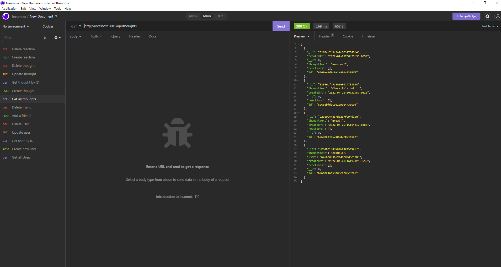

# Social-Media-API

## Description
Some features of this application.
1. Once the server is started then the Mongoose models are synced to the MongoDB database.
2. As shown in the demo all GET routes work.
3. Video will demo how I can create, update, and delete users and thoughts in my database.
4. It will also show how I can create and delete reactions to thoughts and add and remove friends to a user’s friend list.
5. It will also demo how when a user is deleted so are their associated thoughts.

---

## Table of content

* [Description](#description)

* [Usage](#usage)

* [How to Contribute](#how-to-contribute)

* [Links](#links)

* [Questions](#questions)

* [Pictures](#pictures)

---

## Usage

Social Media API. 

## How to Contribute

Pull requests. Feel free to open a pull requst on my GitHub.

## Questions

If you have any questions about this project then you can contact me directly at 

elizabethdberube@gmail.com

----

## Links

[GitHub Repo](https://github.com/elizabethdberube/Social-Media-API) 

[Demo Video](https://drive.google.com/file/d/1LjW2U0BVJcXlh0TBmabHZSSntgI-P40S/view) 

----

## Pictures

